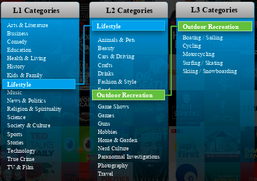

<h1 id="prodtitle" style="color: #33bbb9;">Audio On Demand (AOD) API  1.0</h1>
You are here: AOD API Overview

  <button onclick="clearBrowserCache()">Clear cache</button>

# AOD API Overview 

The Audio on Demand (AOD) API is a REST-based set of requests that provides audio on demand information for podcast series and episodes. It delivers a standardized and enriched descriptive dataset, unlocking the ability for podcast, and talk radio fans who want to listen to podcasts, to discover a broader range of personalities and topics than ever before.

AOD API provides the following features:

<ul>
  <li>Global Dataset - A comprehensive global dataset driving powerful navigation experiences on any platform -- eliminating internal resource strains when clients attempt to build in-house.</li>
  <li>
    
      <a class="MCTextPopupSpot_0">Enriched</a>
      Indicates data that has been added to an episode's information by a Gracenote editor.
     Metadata - Fuels discovery and meaningful recommendations with Gracenote’s leading metadata standards and enhanced metadata descriptors, including in-depth <a class="MCTextPopupSpot_0">Category</a>A Gracenote assigned type of information. Hierarchy, Celebrity Links, and <a class="MCTextPopupSpot_0">Popularity</a>Representative popularity for one show over another.  Available at series level only. Score.</li>
  <li>Cross-Media Linking - Powers engaging cross-media linking opportunities by leveraging Gracenote’s Standard IDs and rich entertainment data.</li>
</ul>

  
    
      <b>
        Note: 
      </b>
    
  There is also a downloadable version of AOD called AOD Data Export. For more information see <a href="https://www.gracenote.com/documentation/aod/start-here.htm">https://www.gracenote.com/documentation/aod/start-here.htm</a>

  <h2>Global Audio on Demand Dataset</h2>
  
The Global Audio on Demand dataset is the catalog of reference driving podcast services with the ability to enhance navigation and discovery capabilities:

  <ul>
    <li>Includes over a million series and millions of episodes globally.</li>
    <li>Deduplicated and normalized data, removing duplicate submissions and encoding issues.</li>
    <li>Includes complete sets of episodes  and is not limited to newer episodes available in RSS feeds.</li>
    <li>Continuously updated multiple times per day to ensure newly released episodes are always available.</li>
  </ul>
  
This comprehensive dataset drives the ability to deliver exclusive content on major catalogs, including Spotify, Apple, and Stitcher, enabling universal search. Gracenote data includes factual data and descriptors allowing listeners to easily find the content that interests them the most. 

  

    <h2>Enriched Metadata</h2>
    
Descriptive metadata to power meaningful search and discovery experiences that connect listeners to more content they want while increasing listenership and engagement: 

    <ul>
      <li>In-Depth Categorization: Standardized classifiers for series and episodes to surface more relevant content.</li>
      <li>Parties and Celebrities: Identify verified celebrity links with unique IDs and role type, including host, co-hosts, guests, subject, and others.</li>
      <li>Recommendations: Leveraging data on similar series to provide content to content recommendations.</li>
    </ul>
    
In-depth categorization at both the <a class="MCTextPopupSpot_0">Series</a>A continuing podcast that contains multiple individual segments. and Episodic levels enables a more engaging and unique discovery experience. It provides up to three levels of categories.  For example:

    
:

    
Gracenote taxonomy includes 400+ unique categories.

    <h2>Popularity Score</h2>
    
The Gracenote Popularity Score provides global and market-specific popularity signals. It enables more relevant podcast suggestions, playlisting, and other discovery experiences. It also improves search capabilities by identifying and surfacing the most popular podcasts in a catalog. The Gracenote Popularity score is on a scale of 0.1 to 1 in increasing order of popularity.  A popularity score is available for all series in the dataset for global and enriched countries.

    <h2>Recommendations</h2>
    
Gracenote Audio on Demand also supports surfacing similar content by leveraging Gracenote’s rich descriptor system. It provides recommendations for the top 10,000 global podcasts with the ability to support more sophisticated personalization algorithms, giving three similar podcasts for each series. 

    

      <h2>Cross-Media Linking</h2>
      
Gracenote's standard IDs and entertainment data combine to power meaningful cross-media linking capabilities that provide more engaging and contextual recommendations.  

      
Standardized IDs assign a common <a class="MCTextPopupSpot_0">Gracenote ID</a>A unique alphanumeric code that identifies a specific person, place, or thing stored within the Gracenote database. of reference for a podcast series, episodes, and celebrities to enable better linking than text based approaches.

      
Gracenote Audio on Demand identifies celebrities in podcasts and links them to the Gracenote Celebrity and Enhanced Celebrity products enabling links to celebrity images and bios to support celebrity based user navigation and experience. 

    

  

## Further Information

For further information about the Audio on Demand API, see the AOD interactive documentation. The page, which requires sign-in, is located at:

[https://nlsn-gracenote-developer.apigee.io/docs/audio-on-demand/1/overview](https://nlsn-gracenote-developer.apigee.io/docs/audio-on-demand/1/overview).

